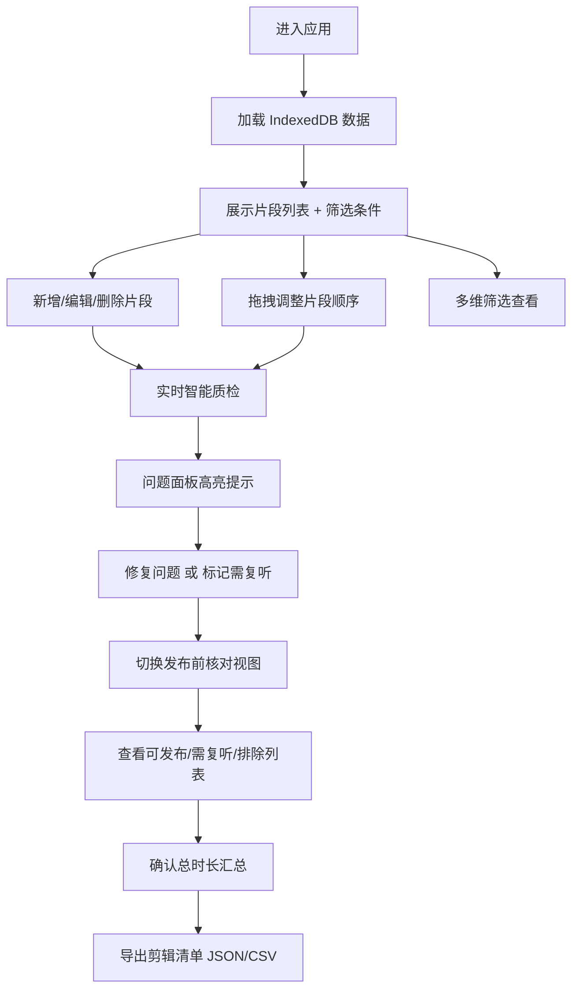

## 1. 产品概述
播客剪辑管理工作台，面向播客制作团队提供录音片段的整理、剪辑顺序编排、口误处理和发布前检查的一站式纯前端工具。
- 解决播客后期制作中片段管理散乱、剪辑顺序混乱、口误遗漏、高风险内容误发布等痛点
- 目标用户：播客制作人、剪辑师、节目策划团队

## 2. 核心功能

### 2.1 用户角色
无角色区分，所有操作用户权限一致。

### 2.2 功能模块
1. **片段管理页**: 片段列表展示、多维筛选、新增/编辑片段、拖拽排序、批量操作、复制备选版本
2. **智能质检模块**: 自动识别时间倒置、时间重叠、同主题过多、需复听缺备注、高风险待发布等问题
3. **发布前核对视图**: 按顺序列出可发布/需复听/被排除片段，汇总总时长
4. **数据导入导出**: 导出剪辑清单为 JSON/CSV 格式

### 2.3 页面详情
| 页面名称 | 模块名称 | 功能描述 |
|-----------|-------------|---------------------|
| 片段管理页 | 顶部筛选栏 | 按主题、说话人、风险等级、发布状态、时长范围筛选片段 |
| 片段管理页 | 片段列表 | 卡片式展示，支持拖拽调整顺序、选择多选、问题标记高亮 |
| 片段管理页 | 片段编辑弹窗 | 编辑标题、起止时间、主题、说话人、剪辑动作、风险等级、发布状态、备注 |
| 片段管理页 | 批量操作栏 | 批量标记待剪辑/已剪辑/需复听/暂不发布，批量删除 |
| 片段管理页 | 智能问题面板 | 实时展示识别到的问题列表，点击跳转定位 |
| 发布前核对页 | 可发布片段区 | 按顺序展示可发布片段，含序号、时长、说话人、主题 |
| 发布前核对页 | 需复听片段区 | 列出需复听片段及原因，突出备注缺失提醒 |
| 发布前核对页 | 被排除片段区 | 列出暂不发布及其他排除原因的片段 |
| 发布前核对页 | 时长汇总区 | 显示各分类总时长及全部片段总时长 |
| 全站 | 导出功能 | 导出当前剪辑清单为 JSON 或 CSV 文件 |

## 3. 核心流程
用户进入应用后，从 IndexedDB 加载已有片段数据。在片段管理页可新增片段、编辑属性、拖拽调整顺序、筛选查看特定片段。系统实时检测数据问题并在问题面板提示。编辑完成后切换到发布前核对视图，确认可发布清单。最终导出剪辑清单交付剪辑团队。

## 4. 用户界面设计

### 4.1 设计风格
- **主色调**: 深石墨色 #1C1C1E 作为背景主色，搭配暖橙色 #FF8C42 作为强调色（代表音频波形、活力）
- **辅助色**: 薄荷绿 #3ECF8E（安全/已通过）、琥珀黄 #FFB020（警告/需注意）、珊瑚红 #FF5A5F（危险/高风险）、雾蓝 #7A8CFF（信息/中性）
- **按钮风格**: 圆角 10px，实心主按钮带微妙阴影，悬停放大 1.02 倍
- **字体**: 标题使用 "Space Grotesk" 现代几何无衬线字体，正文使用 "Inter" 提升可读性
- **布局风格**: 左侧导航 + 右侧内容区的双栏布局，片段卡片采用网格 + 列表切换模式
- **图标风格**: Lucide 图标库，线性风格，统一 20px 尺寸

### 4.2 页面设计概述
| 页面名称 | 模块名称 | UI 元素 |
|-----------|-------------|-------------|
| 片段管理页 | 顶部筛选栏 | 多条件横向排列的下拉筛选器，末尾"新增片段"橙色主按钮 |
| 片段管理页 | 片段卡片列表 | 深灰卡片，左侧拖拽手柄，右侧状态徽章，中间核心信息三栏布局（时间/主题说话人/剪辑动作） |
| 片段管理页 | 问题提示面板 | 右上悬浮卡片，按严重程度分组的问题列表，红/黄/蓝三色标识 |
| 发布前核对页 | 三段式列表 | 三色分组卡片（绿=可发布/黄=需复听/灰=被排除），每组开头有计数徽章和总时长标签 |
| 全站 | 顶部导航 | 深色导航栏，左右两个视图切换 Tab，右侧导出按钮和设置图标 |

### 4.3 响应式
桌面端优先设计，最小支持宽度 1280px。中等屏幕下片段卡片变为单列模式，移动端暂不做完整适配。
