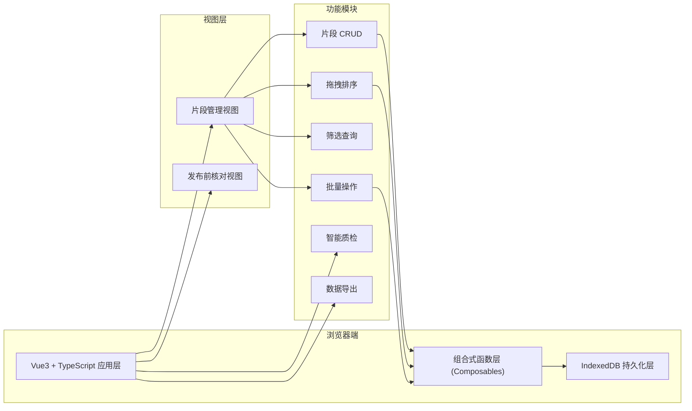
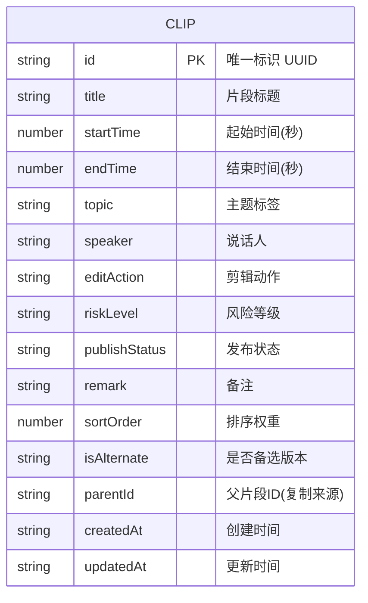

## 1. 架构设计

## 2. 技术描述
- **前端框架**: Vue@3.5 + TypeScript + Vite@5
- **样式方案**: Tailwind CSS@3
- **路由**: Vue Router@4（Hash 模式，纯前端无后端）
- **状态管理**: Vue Composition API + reactive（无需额外状态库）
- **本地持久化**: IndexedDB（使用 idb 封装库简化操作）
- **拖拽库**: vuedraggable@next（基于 SortableJS 的 Vue3 封装）
- **图标库**: lucide-vue-next
- **后端**: 无
- **数据库**: IndexedDB 浏览器本地数据库

## 3. 路由定义
| 路由路径 | 页面组件 | 用途 |
|-------|---------|------|
| / | ClipListView.vue | 片段管理主页（默认路由） |
| /review | ReviewView.vue | 发布前核对视图 |

## 4. 数据模型

### 4.1 数据模型定义 (ER图)

### 4.2 字段枚举值定义
| 字段 | 可选值 |
|------|--------|
| editAction | 保留、剪辑、删除、合并前、合并后、调整顺序 |
| riskLevel | 无风险、低风险、中风险、高风险 |
| publishStatus | 待剪辑、已剪辑、需复听、暂不发布 |

### 4.3 IndexedDB 配置
- 数据库名: `PodcastClipDB`
- 版本号: `1`
- 对象仓库: `clips`
- 索引: `topic`, `speaker`, `riskLevel`, `publishStatus`, `sortOrder`

## 5. 核心模块划分
| 模块文件 | 职责 |
|----------|------|
| src/composables/useDatabase.ts | IndexedDB 封装，提供 CRUD 接口 |
| src/composables/useClips.ts | 片段状态管理、筛选、批量操作 |
| src/composables/useQualityCheck.ts | 智能质检规则引擎 |
| src/composables/useExport.ts | JSON/CSV 导出功能 |
| src/components/ClipCard.vue | 单个片段卡片组件 |
| src/components/ClipEditor.vue | 片段编辑弹窗组件 |
| src/components/FilterBar.vue | 筛选条件栏组件 |
| src/components/QualityPanel.vue | 问题提示面板组件 |
| src/components/BatchActionBar.vue | 批量操作栏组件 |
| src/views/ClipListView.vue | 片段管理主视图 |
| src/views/ReviewView.vue | 发布前核对视图 |
